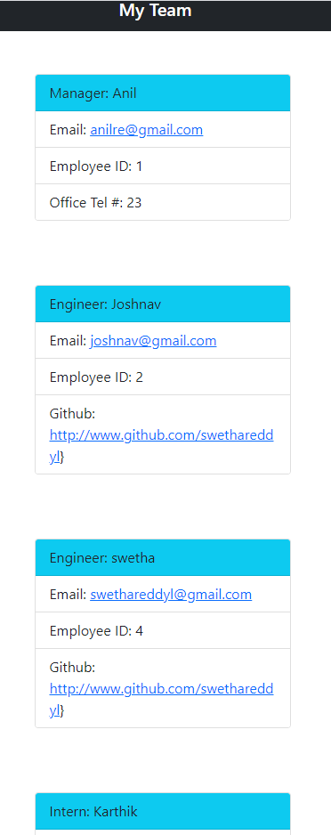

# 10 Object-Oriented Programming: Team Profile Generator

## Your Task

Task is to build a Node.js command-line application that takes in information about employees on a software engineering team, then generates an HTML webpage that displays summaries for each person. Testing is key to making code maintainable, so need to write a unit test for every part of the code and ensure that it passes each test.

## User Story

As a manager, I want to generate a webpage that displays my team's basic info
so that I have quick access to their emails and GitHub profiles

## Acceptance Criteria

Given a command-line application that accepts user input
1. When I am prompted for my team members and their information, then an HTML file is generated that displays a nicely formatted team roster based on user input

2. When I click on an email address in the HTML, then my default email program opens and populates the TO field of the email with the address

3. When I click on the GitHub username, then that GitHub profile opens in a new tab

4. When I start the application, then I am prompted to enter the team manager’s name, employee ID, email address, and office number

5. When I enter the team manager’s name, employee ID, email address, and office number, then I am presented with a menu with the option to add an engineer or an intern or to finish building my team

6. When I select the engineer option, then I am prompted to enter the engineer’s name, ID, email, and GitHub username, and I am taken back to the menu

7. When I select the intern option, then I am prompted to enter the intern’s name, ID, email, and school, and I am taken back to the menu

8. When I decide to finish building my team, then I exit the application, and the HTML is generated

## Mock-Up

The following image shows a mock-up of the generated HTML’s appearance and functionality:

## Link to the recording video

## Github link
https://github.com/swethareddyl/TeamProfileGenerator.git